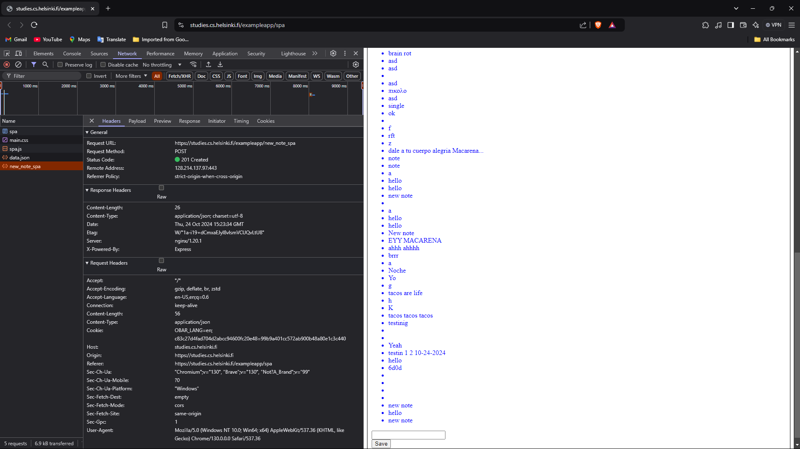

## Creating a diagram depicting the situation where the user creates a new note using the single-page version of the app.



### Diagram

```mermaid
sequenceDiagram
    participant browser
    participant server

    browser->>server: POST https://studies.cs.helsinki.fi/exampleapp/new_note_spa
    activate server
    server-->>browser: Status 201 (Created) {content: "new note", date: "2024-10-24T15:23:34.393Z"}
    deactivate server

    Note right of browser: User creates a new note. Browser executes event handler(no page reload), creates new note object, adds it to notes array, redraws notes on page and sends note to server. Browser stays on the same page and no additional HTTP requests needed.

